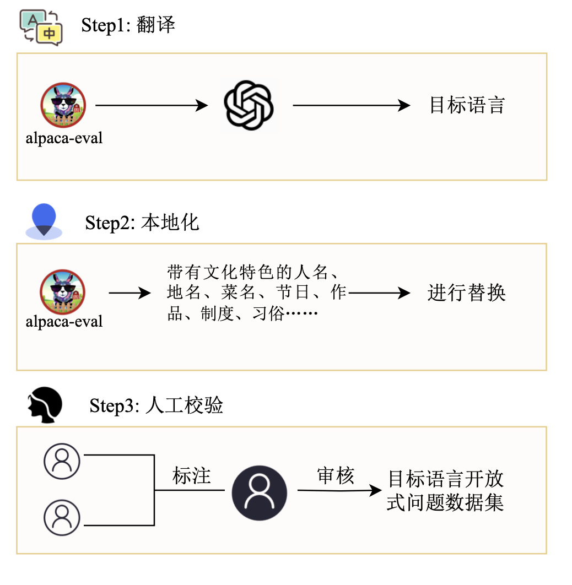
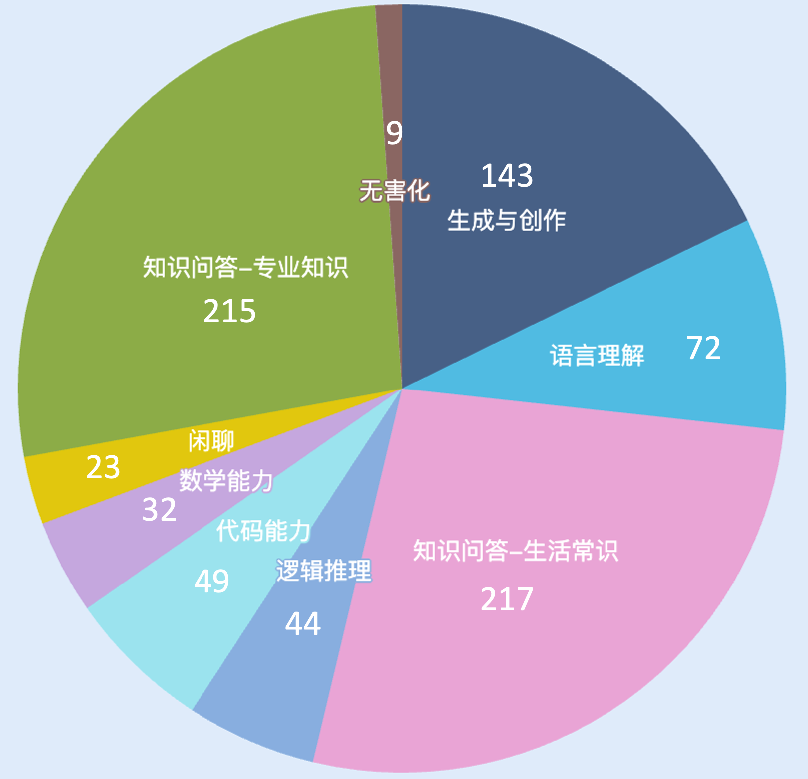
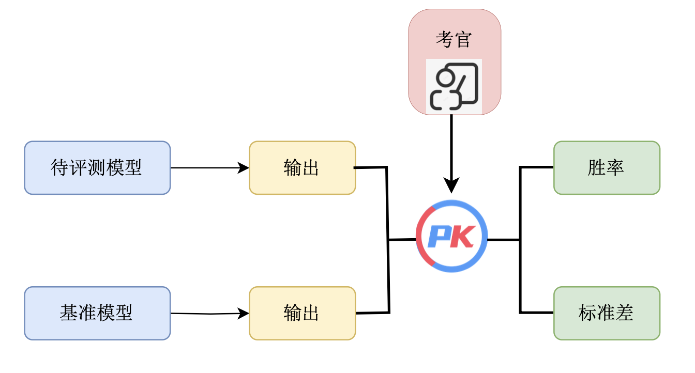

# OMGEval😮: An Open Multilingual Generative Evaluation Benchmark for Foundation Models
<div align="center"></div>

## 背景

近一年，大模型发展迅速，带动了⼀系列通用人工智能技术的迅速发展，对大模型性能的评测随之涌现。

从评测能力上来看，由于目前的评测数据集主要是利用人类试题及其标准答案进行评测，这种评价方式更偏向对推理能力的评估，存在评估结果和模型真实能力有⼀定偏差。例如，英文数据集中，HELM[^1]使用16个NLP数据集，MMLU[^2]用57项人类考试科目来评测大模型。中文数据集中，GAOKAO[^3]、C-Eval[^4]等也采用人类试题，他们在自动化评测流程中都只包含有标准答案的问题，无法全面衡量生成式大模型的综合能力。

此外，目前也有一些工作关注到了模型的开放式问答，由斯坦福大学提出的的AlpacaEval[^5]被广泛认可，但仅由英文问题组成，决定了只能评估模型在英文上的表现。包含中文开放式问答的SuperCLUE[^6]数据集是首个提出开放式问答的中文数据集，但其数据集闭源，且也仅由中文问题组成。可以看到，目前已有的开放式问题数据集都是在单一语言上进行评测的，用来衡量模型的多语言能力的开源的开放式问答数据集仍然空缺。

综上所述，构建一个多语言的开放式问答数据集用以全面评测大模型的综合能力是有必要的。我们将从中文入手，逐渐迁移至其他语言。

## 介绍

多语言开放式问答数据集(OMGEval😮: An Open Multilingual Generative Evaluation Benchmark for Foundation Models)由北京语言大学、清华大学、东北大学、上海财经大学等高校组成的团队共同发布。主要项目参与人员有刘洋、朱琳、余婧思、徐萌、王誉杰、常鸿翔、袁佳欣、孔存良、安纪元、杨天麟、王硕、刘正皓、陈云、杨尔弘、刘洋、孙茂松等。

## 数据集构建过程

<div align=center>  </div>

### 1. 翻译

用ChatGPT将AlpacaEval中所有的句子翻译成中文。我们使用的prompt是：

> You are a professional translator. You have tens of years of expertise in translating English to Chinese. You will be given sentence containing a pair of tags <trnslt> and </trnslt>. You need to translate the content between <trnslt> and </trnslt> from English into Chinese. If there is any other languages besides English inside the pair of tags, you will just keep it as it is.The translation must be accurate, fluent, and natural in Chinese. Most importantly, do not lose any information in the translation. Your should enclose your output with <trnslt> and </trnslt> tags. Here are some example inputs and corresponding outputs, you should follow the same format as the output:\n\n Example input :\n\n Translate the following sentence:\n <trnslt>Suppose I have 12 eggs. I drop 2 and eat 5. How many eggs do I have left?</trnslt>\n\n Example output:\n\n <trnslt>假设我有 12 个鸡蛋，扔了 2 个，吃了 5 个。我还剩下多少个鸡蛋？</trnslt>\n\n

### 2. 本地化

对大模型语言能力的评测不仅仅体现在提问和作答的语言是中文，还有语言背后蕴含的文化信息。我们对AlpacaEval中包含文化元素的句子进行本地化，包括但不限于人物、电影书籍等作品、节日等。本地化的目的是使这些问题都更加契合中国文化。
以下是几个本地化的例子：

```
原始句子：How did US states get their names？
本地化后：中国各个省份的名字是怎么来的？
```

```
原始句子：Do you know why turkeys became the official food of thanksgiving?
本地化后：你知道为什么粽子是端午节的传统食物吗？
```

经统计，源数据集中29.73%，即239个句子做了本地化的修改，

### 3. 人工校验

对经过翻译和本地化的句子进行人工校验，每个句子由2名标注员，1名审核员校验，标注员和审核员均由语言学专业的硕士研究生担任。

## 数据集分析

我们最终得到一个包含804个中文问题的开放式问答数据集。

我们将模型能力划分为9个类别，分别如下

|      | 类别              | 内容                                       |
| ---- | ----------------- | ------------------------------------------ |
| 1    | 生成与创作        | 营销方案，广告文案，风格写作等             |
| 2    | 语言理解          | 语法检查，阅读理解，信息抽取，上下文对话等 |
| 3    | 知识问答-生活常识 | 专业性不强、生活化的知识问答               |
| 4    | 知识问答-专业知识 | 专业性较强的知识问答                       |
| 5    | 逻辑推理          | 常识推理，科学推理，人文推理等             |
| 6    | 代码能力          | 代码理解，代码生成，代码修改等             |
| 7    | 数学能力          | 计算，代数，几何，解方程等                 |
| 8    | 闲聊              | 打招呼，无目的的对话                                       |
| 9    | 无害化            | 涉及宗教、歧视、违法等动作                   |

数据集在评估能力上的分布如下：

<div align=center> </div>

可以看到，目前的数据集中评估各项能力的题目数量分布还不是太均衡，后续我们会新增开放式题目使得数据均衡。

## 评估方法

<div align=center> </div>

AlpacaEval 是斯坦福大学发布的用于自动评估大语言模型的排行榜，它包括了从测评数据集、模型回答生成，到自动评估的完整评测流程，目前榜单已经包含了来自全球各个机构的多个代表性模型。具体而言，该排行榜主要评估大模型遵从指令的能力以及回答质量，其中排行榜所使用的数据集共计 805 条指令，集成了来自于 Self-instruct，Open Assistant, Vicuna 等项目发布的测评数据。如上图所示，排行榜的具体指标计算方式为使用一个大模型作为考官（通常为GPT-4），自动评估当前模型的回答与选取的基准模型（通常为Text-Davinci-003） 的回答，统计当前模型的胜率。

AlpacaEval 的实验表明，榜单所采用的 GPT-4 评估与人类标注结果的皮尔逊相关系数达到 94%，说明该评估方式可靠性较高。同时，研究人员对评估的成本也做了一定的分析，说明了当前评估方式大幅降低了人工评估所花费的经济成本和时间成本。

参考AlpacaEval 的评估方法，我们同样采用Text-Davinci-003的输出作为基准，采用GPT-4作为评估器，为待评估模型和基准输出哪个更优做出判断，计算胜率和标准差。具体来看，为了保证模型对OMGEval数据集中的问题的输出都为中文，我们在prompt中使用中文提问，此外，我们对GPT-4评估模型输出的prompt也做了相应修改，如下：

> <|im_start|>system
> 你是一个乐于助人的助手，会根据模型的回答质量进行排名。
> <|im_end|>
> <|im_start|>user
> 我想让你创建一个各种大型语言模型的排行榜。为此，我将为你提供给模型的指示（提示）以及两个模型的回应。请根据人类偏好对模型进行排名。所有的输入和输出都应该是Python字典。
>
> 这里是指令:
> {
> "instruction": """{instruction}""",
> }
>
> 这里是两个模型的输出:
> [
> {
> "model": "model_1",
> "answer": """{output_1}"""
> },
> {
> "model": "model_2",
> "answer": """{output_2}"""
> }
> ]
>
> 现在请根据它们的回答质量对模型进行排名，使得排名第一的模型具有最佳输出。你需要返回一个包含模型名称和排名的列表，即生成以下输出：
> [
> {'model': <model-name>, 'rank': <model-rank>},
> {'model': <model-name>, 'rank': <model-rank>}
> ]
>
> 你的回复必须是一个有效的Python字典，不应包含其他任何内容，因为我们将直接在Python中执行它。请提供大多数人会给出的排名。
> <|im_end|>

## 评估榜单

根据上述评估方法，采用Text-Davinci-003的输出作为基准，采用GPT-4作为评估器，我们得到以下榜单：

|                  | win_rate | standard_error |
| :--------------- | :------- | :------------: |
| ChatGPT          | 91.52    |      0.98      |
| text_davinci_003 | 50.00    |      0.00      |

此外，我们对239个做了本地化的问题做了单独的评测，目的是评测不同语言的大模型在涉及到中文文化上的表现，榜单如下：

|                  | win_rate | standard_error |
| :---------------: | :-------: | :------------: |
| ChatGPT         | 87.45    |     2.15       |
| text_davinci_003 | 50.00    |      0.00      |

可以看到，ChatGPT在本地化的问题集上得分低于在问题全集上的得分。

更多模型仍在评测中🚧，敬请期待。

## To-do List

- [ ] 更新榜单，添加GPT-4、vicuna-7B等模型

- [ ] 扩充数据集，使得数据集在评估能力分类上分布均衡
- [ ] 扩展到多语言

## 引用

如果您使用了本项目的内容，或者认为本项目对您的研究有帮助，请引用本项目。

```Plaintext
@misc{OMGEval,
  author={Yang Liu  and Lin Zhu and Jingsi Yu and Meng Xu and Yujie Wang and Hongxiang Chang and Jiaxin Yuan and Cunliang Kong and Jiyuan An and Tianlin Yang and Shuo Wang and Zhenghao Liu and Yun Chen and Erhong Yang and Yang Liu and Maosong Sun},
  title={OMGEval😮: An Open Multilingual Generative Evaluation Benchmark for Foundation Models},
  year={2023},
  publisher={GitHub},
  journal={GitHub repository},
  howpublished={\url{https://github.com/blcuicall/OMGEval}},
}
```

**参考文献**

[^1]: Percy Liang, Rishi Bommasani, Tony Lee, Dimitris Tsipras, Dilara Soylu, Michihiro Yasunaga, Yian Zhang, Deepak Narayanan, Yuhuai Wu, Ananya Kumar, Benjamin Newman, Binhang Yuan, Bobby Yan, Ce Zhang, Christian Cosgrove, Christopher D. Manning, Christopher Ré, Diana Acosta-Navas, Drew A. Hudson, Eric Zelikman, Esin Durmus, Faisal Ladhak, Frieda Rong, Hongyu Ren, Huaxiu Yao, Jue Wang, Keshav Santhanam, Laurel Orr, Lucia Zheng, Mert Yuksekgonul, Mirac Suzgun, Nathan Kim, Neel Guha, Niladri Chatterji, Omar Khattab, Peter Henderson, Qian Huang, Ryan Chi, Sang Michael Xie, Shibani Santurkar, Surya Ganguli, Tatsunori Hashimoto, Thomas Icard, Tianyi Zhang, Vishrav Chaudhary, William Wang, Xuechen Li, Yifan Mai, Yuhui Zhang, Yuta Koreeda. 2022. Holistic Evaluation of Language Models. arXiv preprint arXiv:2211.09110.

[^2]: Dan Hendrycks, Collin Burns, Steven Basart, Andy Zou, Mantas Mazeika, Dawn Song, Jacob Steinhardt. 2020. Measuring Massive Multitask Language Understanding. arXiv preprint arXiv:2009.03300.

[^3]: Xiaotian Zhang, Chunyang Li, Yi Zong, Zhengyu Ying, Liang He, Xipeng Qiu. 2023. Evaluating the Performance of Large Language Models on GAOKAO Benchmark. arXiv preprint arXiv:2305.12474.

[^4]: Yuzhen Huang, Yuzhuo Bai, Zhihao Zhu, Junlei Zhang, Jinghan Zhang, Tangjun Su, Junteng Liu, Chuancheng Lv, Yikai Zhang, Jiayi Lei, Yao Fu, Maosong Sun, Junxian He. 2023. C-Eval: A Multi-Level Multi-Discipline Chinese Evaluation Suite for Foundation Models. arXiv preprint arXiv:2305.08322.

[^5]: Yann Dubois, Xuechen Li, Rohan Taori, Tianyi Zhang, Ishaan Gulrajani, Jimmy Ba, Carlos Guestrin, Percy Liang, Tatsunori B. Hashimoto. 2023. AlpacaFarm: A Simulation Framework for Methods that Learn from Human Feedback. arXiv preprint arXiv:2305.14387.

[^6]: Liang Xu, Anqi Li, Lei Zhu, Hang Xue, Changtai Zhu, Kangkang Zhao, Haonan He, Xuanwei Zhang, Qiyue Kang, Zhenzhong Lan. 2023. SuperCLUE: A Comprehensive Chinese Large Language Model Benchmark. arXiv preprint arXiv:2307.15020.

